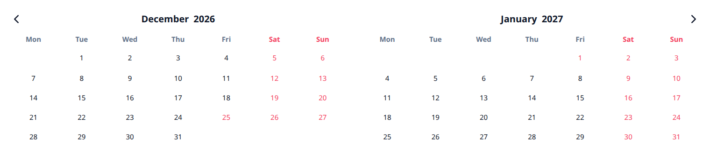
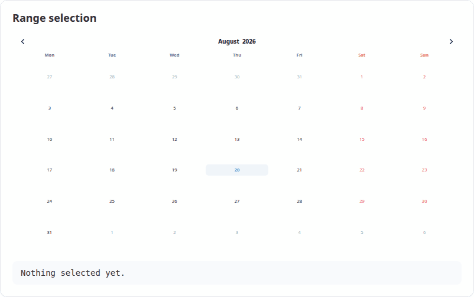
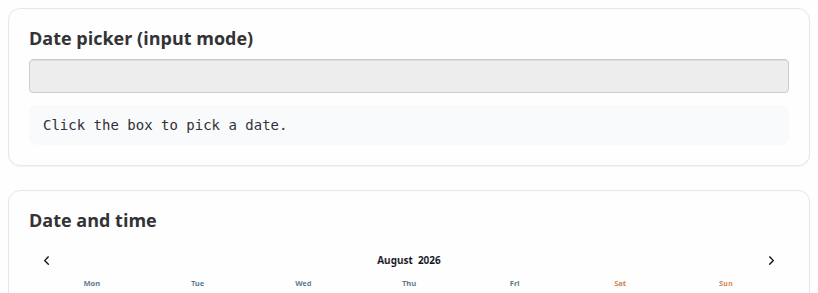
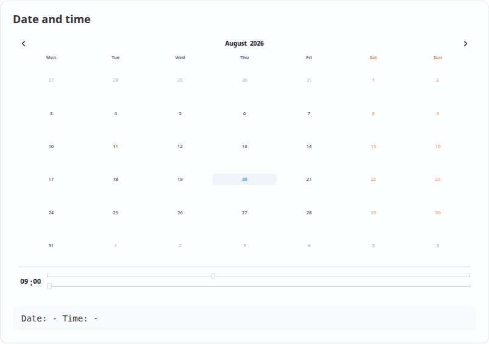
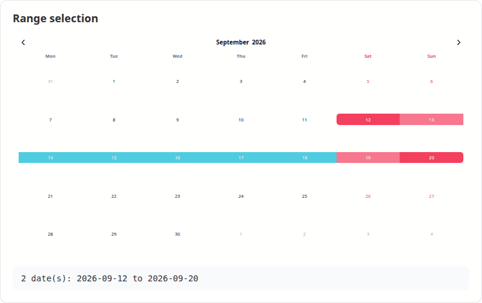
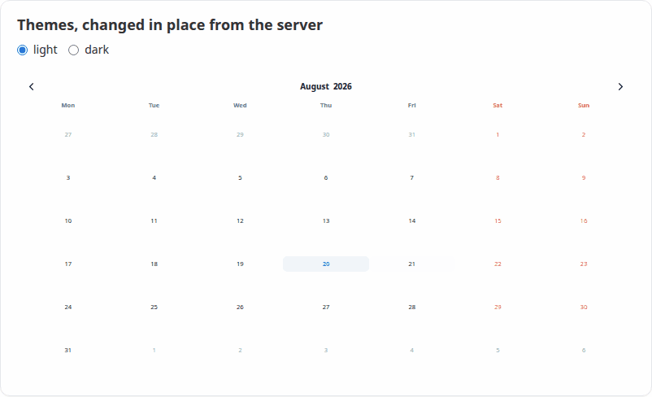

# VanillaCalendar

An [`htmlwidget`](https://www.htmlwidgets.org/) bringing
[Vanilla Calendar Pro](https://vanilla-calendar.pro/) to R and Shiny — a modern,
dependency-free calendar, date picker and time picker, configured from R.



Bundles Vanilla Calendar Pro 3.2.0. No internet connection, no CDN and no
JavaScript build step needed.

## Install

```r
remotes::install_github("ESCRI11/vanilla-calendar-r")
```

## Use

```r
library(VanillaCalendar)

VanillaCalendar()
```

Any option from the
[Vanilla Calendar Pro reference](https://vanilla-calendar.pro/docs/reference/additionally/settings)
is passed straight through as a named list:

```r
VanillaCalendar(
  options = list(
    type = "default",
    locale = "en",
    selectionDatesMode = "multiple",
    selectedDates = Sys.Date(),
    selectedTheme = "light"
  ),
  width = "500px",
  height = "400px"
)
```

R values are adapted for you: `Date` and `POSIXct` become the `"YYYY-MM-DD"`
strings the library expects, and options that must be JSON arrays are boxed, so
a single date works where the library wants a list. Misspelled option names
warn rather than being silently ignored.

## In Shiny

Three steps: `VanillaCalendarOutput()` in the UI, `renderVanillaCalendar()` in
the server, and read the dates from `input$<id>_selected`. That is a complete
app:

```r
library(shiny)
library(VanillaCalendar)

ui <- fluidPage(
  titlePanel("Pick a date"),
  VanillaCalendarOutput("cal", height = "400px"),
  textOutput("chosen")
)

server <- function(input, output) {
  output$cal <- renderVanillaCalendar(VanillaCalendar())
  output$chosen <- renderText({
    if (length(input$cal_selected) == 0) "Nothing picked yet."
    else format(input$cal_selected, "%A, %d %B %Y")
  })
}

shinyApp(ui, server)
```

`input$cal_selected` is a `Date` vector — `Date(0)` when nothing is selected,
so `format()` and `min()` never blow up on an empty calendar. Options change
what the user can do without changing any of the structure above:

```r
# a date range instead of one date
output$cal <- renderVanillaCalendar(
  VanillaCalendar(list(selectionDatesMode = "multiple-ranged"))
)

# a text box with a popup, instead of a block of calendar
output$cal <- renderVanillaCalendar(
  VanillaCalendar(list(inputMode = TRUE), height = "auto")
)
```

Both apps ship with the package, so you can run them before writing anything:

```r
# the app above, in full
shiny::runApp(system.file("examples/minimal", package = "VanillaCalendar"))

# the demo every screenshot below comes from
shiny::runApp(system.file("examples/gallery", package = "VanillaCalendar"))
```

### Selecting dates

`selectionDatesMode` takes `"single"`, `"multiple"` or `"multiple-ranged"`.
Whatever the user picks arrives in `input$<id>_selected` as a `Date` vector —
length 0 when nothing is selected, so `format()` and `as.Date()` never blow up
on an empty calendar.



```r
output$cal <- renderVanillaCalendar(
  VanillaCalendar(list(selectionDatesMode = "multiple-ranged"))
)
output$out <- renderText(paste(format(input$cal_selected), collapse = " to "))
```

### A date picker, not a wall of calendar

Set `inputMode = TRUE` and the widget renders a text box that opens the
calendar as a popup, filling the box with the chosen date. Pair it with
`height = "auto"`. See the upstream
[input mode docs](https://vanilla-calendar.pro/docs/reference/additionally/settings).



```r
VanillaCalendar(
  options = list(inputMode = TRUE, selectionDatesMode = "single"),
  height = "auto"
)
```

### Time

`selectionTimeMode = 24` (or `12`) adds a time picker below the dates. The
chosen time arrives in `input$<id>_time` as a string such as `"14:30"`. The
`timeMinHour`, `timeMaxHour` and `timeStepMinute` options constrain it.



```r
VanillaCalendar(list(selectionTimeMode = 24, selectedTime = "09:00"))
```

### Months and years

Clicking the month or the year opens a picker for it. Both are reported to
Shiny, with months as 1-12 rather than the JavaScript 0-11.



### Themes, changed without re-rendering

`VanillaCalendarProxy()` reaches a calendar that is already on the page, so
options can be changed in place — the calendar keeps its selection, position
and focus instead of flickering back to its initial state. Only the parts you
are actually setting change; pass `reset` to clear anything else.



```r
observeEvent(input$theme, {
  vcSet(VanillaCalendarProxy("cal"), list(selectedTheme = input$theme))
})
```

The proxy verbs mirror the library's
[instance methods](https://vanilla-calendar.pro/docs/reference/additionally/methods):

| Function | Does |
|---|---|
| `vcSet(proxy, options, reset)` | Apply new options |
| `vcUpdate(proxy, reset)` | Re-render with the current options |
| `vcShow(proxy)` / `vcHide(proxy)` | Show or hide a popup calendar |
| `vcDestroy(proxy)` | Remove the calendar |

`selectedTheme` accepts `"light"`, `"dark"` or `"system"`. In system mode the
theme is read from the attribute named by `themeAttrDetect`, which defaults to
`"html[data-theme]"`; **bslib** apps should set
`themeAttrDetect = "html[data-bs-theme]"` to follow the app.

## Shiny inputs

For an output with id `"cal"`:

| Input | Type | Set when |
|---|---|---|
| `input$cal_selected` | `Date` vector | A date is clicked |
| `input$cal_selected_month` | integer, 1-12 | A month is chosen |
| `input$cal_selected_year` | integer | A year is chosen |
| `input$cal_displayed` | `Date`, first of the month | The arrows are used |
| `input$cal_time` | character, e.g. `"14:30"` | The time changes |
| `input$cal_week` | list of `week` and `year` | A week number is clicked |
| `input$cal_ready` | `TRUE` | The calendar has initialised |

## Custom JavaScript

Callbacks are options like any other, passed with `htmlwidgets::JS()`. They run
in addition to the built-in handlers above, so adding one does not cost you the
matching Shiny input:

```r
VanillaCalendar(list(
  onClickDate = htmlwidgets::JS("function(self) { console.log(self.context.selectedDates); }")
))
```

The full callback list — `onClickWeekDay`, `onCreateDateEls`, `onChangeTime`
and the rest — is in the
[upstream reference](https://vanilla-calendar.pro/docs/reference/additionally/settings).

## Learn more

* `vignette("VanillaCalendar")` — a guided tour of the widget
* `vignette("shiny")` — using the widget in Shiny apps
* [Vanilla Calendar Pro documentation](https://vanilla-calendar.pro/docs) — the
  option reference this package passes through to

## Licence

GPL (>= 3). The bundled Vanilla Calendar Pro library is MIT licensed,
copyright Yury Uvarov; its licence ships in
`inst/htmlwidgets/lib/VanillaCalendar-3.2.0/LICENSE`.
